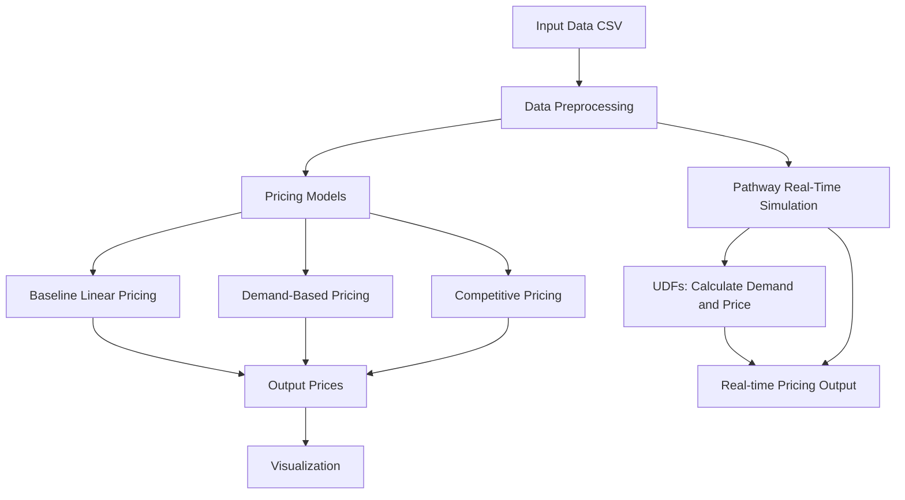

# Dynamic Parking Pricing Models

## Project Overview

This project explores and implements different dynamic pricing strategies for parking lots based on real-time data such as occupancy, queue length, traffic conditions, and nearby parking lot prices. The goal is to develop models that can adjust parking prices dynamically to optimize revenue and manage parking space utilization effectively. The project implements three distinct pricing models: a baseline linear model, a demand-based model, and a competitive pricing model, culminating in a real-time simulation pipeline using the Pathway library.

## Tech Stack

*   **pandas:** Used for data manipulation and analysis.
*   **numpy:** Used for numerical operations, especially in price calculations and array manipulation.
*   **bokeh:** Used for interactive data visualization to compare the pricing models.
*   **pathway:** Used for building a real-time data processing pipeline for dynamic pricing simulation.
*   **scikit-learn:** Specifically `BallTree` is used for efficient spatial lookups in the competitive pricing model.
*   **math:** Used for mathematical operations, particularly in geographic calculations.

## Architecture

The project architecture is designed to process parking data, apply different pricing models, and simulate a real-time pricing system.

### Architecture Diagram

The following diagram illustrates the data flow and components of the dynamic pricing system. You can visualize this diagram by copying the following Mermaid code into a Mermaid-compatible viewer or markdown renderer (like on GitHub or in a live editor).

### Architecture and Workflow Explanation

The workflow begins with loading the parking data from a CSV file into a pandas DataFrame.

1.  **Data Preprocessing:** The data is sorted by `SystemCodeNumber` and `datetime` to ensure chronological processing. A `datetime` column is created by combining the date and time columns. Vehicle types are encoded with weights for the demand function, and traffic conditions are also encoded numerically.

2.  **Pricing Models:** Three distinct pricing models are implemented:
    *   **Baseline Linear Pricing:** This model adjusts the price linearly based on the occupancy rate of a parking lot. It maintains a history of the previous price for each lot and increments it based on the current occupancy relative to capacity.
    *   **Demand-Based Pricing:** This model calculates a 'demand' score based on various factors including occupancy rate, queue length, traffic conditions, special events, and vehicle type. This demand score is then normalized using the hyperbolic tangent function, and the price is adjusted based on this normalized demand and a base price. The price is clipped to a defined range.
    *   **Competitive Pricing:** This model considers the prices of nearby parking lots. It first identifies neighboring lots within a certain radius using spatial indexing (`BallTree`). Then, for each parking lot at a given timestamp, it calculates the average price of its neighbors. If a lot is fully occupied, its price is set to the minimum of its current demand-based price and the average competitive price. If the average competitive price is higher than the lot's current price, the lot's price is increased slightly (capped at a maximum). Otherwise, the demand-based price is maintained.

3.  **Visualization:** Bokeh is used to visualize the prices generated by the different models over time for a selected parking lot, allowing for a comparison of their behavior.

4.  **Pathway Real-Time Simulation:** Pathway is integrated to demonstrate how the dynamic pricing could work in a real-time streaming scenario.
    *   A Pathway pipeline is built to read the data as a stream.
    *   User-Defined Functions (UDFs) are defined for `calculate_demand` and `calculate_price`, mirroring the logic from the pandas implementation but designed for Pathway's data streaming model.
    *   The pipeline processes the input stream, calculates demand using the UDF, and then calculates the final price using the pricing UDF.
    *   The relevant output (lot ID, timestamp, and final price) is selected for a potential output sink.
    *   `pw.run()` is called to execute the real-time pipeline.

This architecture allows for the exploration of different pricing strategies and provides a foundation for building a real-time dynamic parking pricing system.
